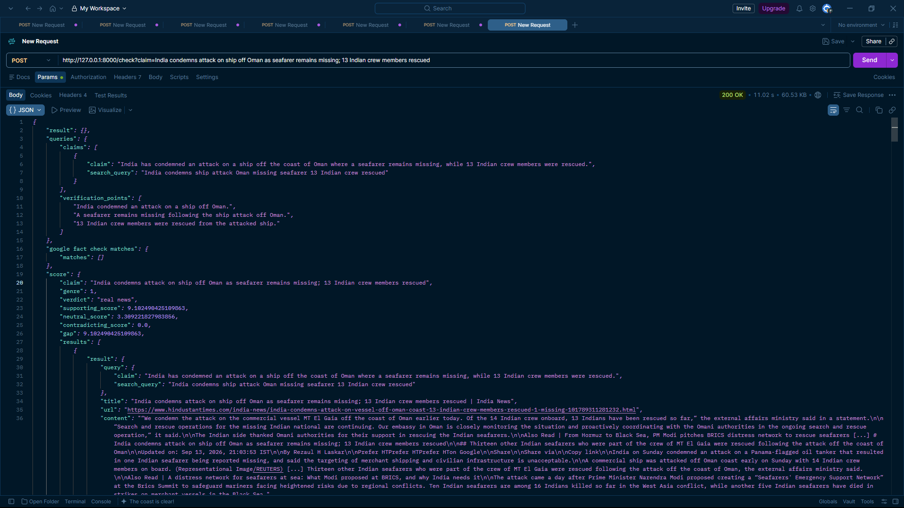

# Fake News Detection & Verification Backend

A lightweight NLP-based backend that analyzes a news claim using web
evidence and classifies it into one of five credibility levels.

> **Backend-only project:** This repository focuses on the ML, NLP,
> search, and fact-checking pipeline. No frontend is currently included.

## Features

-   Claim and verification-point extraction
-   Google Fact Check matching
-   Web evidence retrieval with Tavily
-   Semantic evidence selection with SBERT
-   NLI-based entailment / contradiction / neutral classification
-   News genre classification
-   Source reputation scoring
-   Multi-source evidence aggregation
-   Five-level final verdict
-   Detailed JSON response for inspecting the verification process

## Pipeline

``` text
News Claim
    ↓
Google Fact Check
    ↓
Claim & Verification Point Extraction
    ↓
Genre Prediction
    ↓
Tavily Web Search
    ↓
SBERT Evidence Retrieval
    ↓
NLI Classification
    ↓
Source Reputation Weighting
    ↓
Evidence Aggregation
    ↓
Final Verdict
```

## Verdicts

  Verdict           Meaning
  ----------------- ---------------------------------------
  `real news`       Strong supporting evidence
  `likely true`     Evidence generally supports the claim
  `uncertain`       Evidence is insufficient or mixed
  `false rumours`   Evidence leans against the claim
  `fake`            Strong contradicting evidence

## API

### `POST /check`

Analyzes a news claim.

Example:

``` http
POST /check?claim=India%20has%20condemned%20an%20attack%20on%20a%20ship%20off%20Oman
```

The response contains the generated queries, verification points, Google
Fact Check matches, retrieved evidence, NLI classifications,
reputation-weighted scores, and final verdict.

Example:

``` json
{
  "result": {},
  "queries": {
    "claims": [],
    "verification_points": []
  },
  "google fact check matches": [],
  "score": {
    "verdict": "real news",
    "supporting_score": 9.10,
    "neutral_score": 3.31,
    "contradicting_score": 0.0,
    "gap": 9.10
  }
}
```



### `GET /health`

Development/test endpoint used to check the NLI model. It is not part of
the main verification workflow.

## Project Structure

``` text
backend/
├── ml/
│   ├── decision_tree_model.pkl
│   ├── logistic_regression_model.pkl
│   ├── tfidf_vectorizer.pkl
│   └── experiments.ipynb
│
├── services/
│   ├── fakeornot.py
│   ├── search.py
│   └── semantic.py
│
├── main.py
├── news_genre_dataset.csv
├── news_source_reputation_all_categories.csv
├── .env
├── .gitignore
└── README.md
```

`main.py` acts as the orchestration layer connecting the different
services.

## Machine Learning

-   **Genre classification:** classical ML models including Logistic
    Regression.
-   **Semantic retrieval:** `sentence-transformers/all-MiniLM-L6-v2`.
-   **NLI:** `cross-encoder/nli-deberta-v3-small`.
-   **Source reputation:** category-specific domain reputation scores
    ranging from `0.000` to `1.000`.

## Setup

``` bash
git clone <repository-url>
cd <repository-name>

python -m venv .venv
.venv\Scripts\activate

pip install -r requirements.txt
```

Create a `.env` file with the required API keys:

``` env
TAVILY_API_KEY=your_key
# other required keys
```

Run the backend:

``` bash
uvicorn main:app --reload
```

## Limitations

The system is an evidence-assisted verification tool, not an absolute
truth detector. Results depend on search quality, available sources,
model predictions, and the quality of the submitted claim.

## Disclaimer

This project is intended for educational and research purposes.
Important claims should always be verified using the underlying sources
and independent fact-checking organizations.
